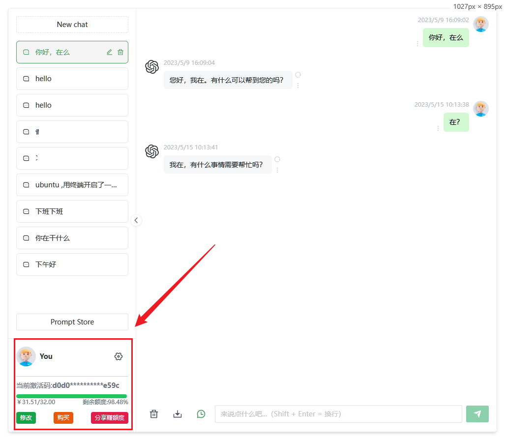
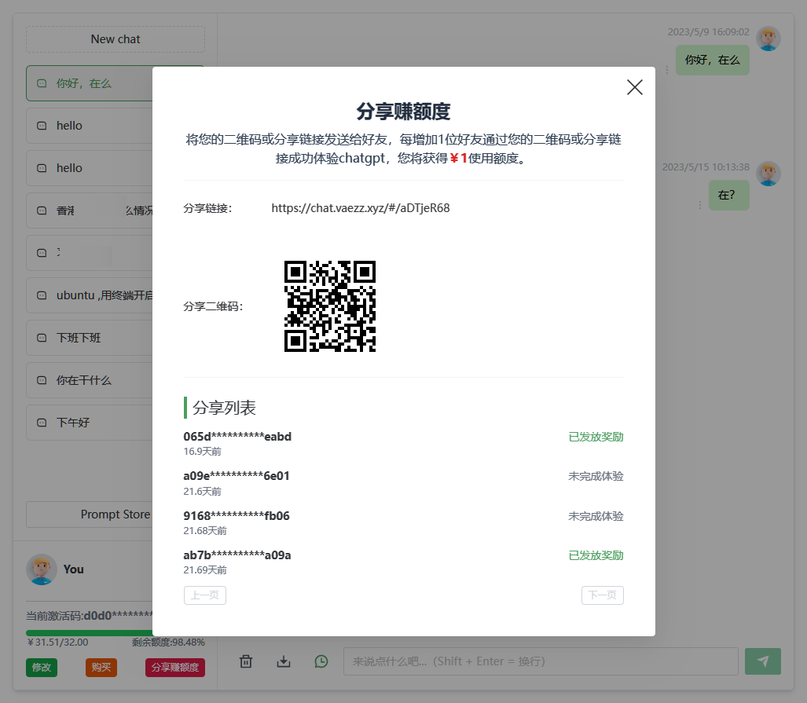

# ChatGPT Web

> 声明：此项目是在ChatGPT-Web项目基础上，增加了一些功能 [原项目地址](https://github.com/Chanzhaoyu/chatgpt-web)
1. 增加激活码功能（每个新的IP默认赠送一部分，用完需要购买激活码）
2. 增加分享赚额度的功能 ( 如果不想购买，可以通过分享网站，有人点进来使用就获得额度 )




## 部署

暂时只支持docker-compose一键部署 ,git 拉下代码之后，在根目录下执行
```bash
docker-compose up -d
```

> 启动容器之前：需要先做一些配置，配置文件在 `/service/config` 目录中，配置方式可以参考eggjs的配置文件，如果你只是要正常运行不修改代码，你需要配置的有：
> 1. `config.prod.js` 中的 `config.openai` ，填充key 和 base_url（这个是反向代理的地址，一般国内服务器都无法直接访问 api.openai.com，你需要找台可以访问的服务器反代。如果你不需要反向代理，可以直接填写 `https://api.openai.com`，如果你在国外服务器，配置好 `config.openai.key` 和 `config.openai.base_url` 之后就可以了）
> 2. 如果你是直接在国内服务器部署，也可以直接配置config.socks5，配置好之后访问openai的接口会先走socks5代理，这样就不需要第一步说的反向代理了，前提你有一个socks5代理服务器